# eVTOL Flight Sim Dependency Map

Last reviewed: 2026-04-26 17:48 PDT

This document maps the active repo-root workflow after the filename cleanup. It
is intentionally focused on live files, not archived campaigns.

## Current Naming Convention

Top-level workflow scripts now use short, role-first names:

`Init_Main.m` is the canonical initialization script. There is no separate
one-line initialization wrapper.

| Old name | New name | Role |
| --- | --- | --- |
| `Init_EVTOL_Main.m` | `Init_Main.m` | initialize workspace |
| `Trim_EVTOL_Main.m` | `Trim_Main.m` | run one explicit trim case |
| `Run_EVTOL_Main.m` | `Run_Main.m` | prepare/run wrapper simulation |
| `Run_Transition_Trim_Search.m` | `TrimSearch_Run.m` | user-facing transition search |
| `Run_Trim_Transition_Midband_GuideGrid_Scored.m` | `TrimSearch_Engine.m` | internal trim-search engine |
| `build_midband_guidegrid_plan.m` | `TrimSearch_BuildPlan.m` | target/seed-plan builder |
| `Build_Transition_Trim_Databases.m` | `TrimDB_Build.m` | build master/controller DBs |
| `Update_Transition_Trim_Master_Attempt_DB.m` | `TrimDB_UpdateMaster.m` | append search results to master DB |
| `Plot_Transition_Trim_Databases.m` | `TrimDB_Plot.m` | plot DB coverage and controller points |
| `Clean_Transition_Trim_Workspace.m` | `TrimWorkspace_Clean.m` | cleanup generated trim artifacts |

Controller helpers were also shortened:

| Old name | New name |
| --- | --- |
| `build_transition_corridor_lqr_controller.m` | `build_corridor_lqr_controller.m` |
| `build_trim_point_longitudinal_lqr_controller.m` | `build_trim_lqr_controller.m` |
| `select_transition_corridor_path_from_controller_db.m` | `select_corridor_path_from_db.m` |
| `rebuild_trim_result_from_controller_db_point.m` | `trim_result_from_controller_db_point.m` |
| `build_transition_corridor_test_preset.m` | `build_corridor_test_preset.m` |
| `make_transition_path_schedule_cmds.m` | `make_path_schedule_cmds.m` |
| `make_transition_path_schedule_cmds_segmented.m` | `make_segmented_path_schedule_cmds.m` |

Low-speed search helpers were shortened:

| Old name | New name |
| --- | --- |
| `make_low_speed_prop_first_pass_seed.m` | `make_low_speed_prop_seed.m` |
| `make_low_speed_two_pass_seed.m` | `make_low_speed_surface_seed.m` |
| `measure_trim_point_control_effectiveness.m` | `measure_trim_control_effectiveness.m` |
| `plot_report_responses_transition_debug.m` | `plot_transition_debug.m` |

## Canonical Workflow Graph

```mermaid
flowchart TD
  Init["Init_Main.m"] --> Aircraft["aircraft_def.m"]
  Init --> Scenario["scenario_def.m"]
  Init --> PolarMAT["databases/aero_polars/final_airfoil_polar_tables.mat"]

  Trim["Trim_Main.m"] --> Init
  Trim --> TrimCase["trim_evtol_case.m"]
  TrimCase --> Aircraft

  SearchRun["TrimSearch_Run.m"] --> SearchEngine["TrimSearch_Engine.m"]
  SearchEngine --> Init
  SearchEngine --> SearchPlan["TrimSearch_BuildPlan.m"]
  SearchEngine --> PropSeed["make_low_speed_prop_seed.m"]
  SearchEngine --> SurfaceSeed["make_low_speed_surface_seed.m"]
  SurfaceSeed --> PropSeed
  SearchEngine --> TrimCase
  SearchEngine --> Score["score_trim_point.m"]
  SearchEngine --> MasterUpdate["TrimDB_UpdateMaster.m"]
  Paths["TrimDB_Paths.m"] --> MasterDB["databases/trim_attempts.*"]
  Paths --> ControllerDB["databases/controller_schedule.*"]
  MasterUpdate --> MasterDB

  DBBuild["TrimDB_Build.m"] --> MasterDB
  DBBuild --> LinFiles["databases/transition_trim_linearizations/*.mat (when generated)"]
  DBBuild --> ExistingController["existing databases/controller_schedule.mat"]
  DBBuild --> ControllerDB

  PathSelect["select_corridor_path_from_db.m"] --> ControllerDB
  CtrlBuild["build_corridor_lqr_controller.m"] --> PathSelect
  CtrlBuild --> DBTrim["trim_result_from_controller_db_point.m"]
  CtrlBuild --> TrimLQR["build_trim_lqr_controller.m"]
  CtrlBuild --> ControllerData["controllerData"]

  Run["Run_Main.m"] --> Init
  Run --> ControllerData
  Run --> Wrapper["Wrapper.slx"]

  PlotDB["TrimDB_Plot.m"] --> MasterDB
  PlotDB --> ControllerDB
```

## Trim/Search Dependencies

- `Trim_Main.m` is the single-case user entrypoint.
- `trim_evtol_case.m` is the shared trim/linearization engine.
- `TrimSearch_Run.m` is the user-facing transition search entrypoint.
- `TrimSearch_Engine.m` loops over targets, seeds, and trim families.
- `TrimSearch_BuildPlan.m` builds targets and guide/anchor seed plans.
- `make_low_speed_prop_seed.m` and `make_low_speed_surface_seed.m` provide low-speed physics seeds.
- `score_trim_point.m` classifies exact, acceptable, borderline, and unusable points.
- `TrimDB_UpdateMaster.m` appends search summaries into the canonical master DB.

## Database Dependencies

- `TrimDB_Paths.m` defines the canonical database and generated-output paths.
- `TrimDB_UpdateMaster.m` writes/updates `databases/trim_attempts.*`.
- `TrimDB_Build.m` reads the master DB plus linked database-local linearization MAT files when present, then writes `databases/controller_schedule.*`.
- If historical raw linearization files are absent, `TrimDB_Build.m` preserves already-inlined controller points from the existing `controller_schedule.mat`.
- `TrimDB_Plot.m` reads both DBs for coverage and path visualization.
- `TrimWorkspace_Clean.m` cleans `workspace_plots/`; durable DB artifacts belong in `databases/`.

## Controller Dependencies

- `build_corridor_lqr_controller.m` is the main controller builder.
- `select_corridor_path_from_db.m` selects a coherent path through `controller_schedule`.
- `trim_result_from_controller_db_point.m` reconstructs trim-like structs from DB points.
- `build_trim_lqr_controller.m` builds local longitudinal LQR gains.
- Runtime dispatch flows through `controllers/controller_dispatch.m`.
- The active scheduled controller is `controllers/controller_lqr_path_schedule_gated.m`.

## Runtime Dependencies

- `Run_Main.m` consumes `initData`, `trimResult`, optional `controllerData`, and optional `runCase`.
- `Run_Main.m` prepares workspace variables for `Wrapper.slx`.
- `plot_outputs.m`, `plotting/plot_report_responses.m`, and `plotting/plot_transition_debug.m` consume wrapper outputs after a run.
- `plotting/plot_aero_polars.m` reads `databases/aero_polars/final_airfoil_polar_tables.mat` directly for aero inspection plots.

## Support Asset Dependencies

- `Init_Main.m` looks for AVL polar tables at `databases/aero_polars/final_airfoil_polar_tables.mat` first.
- For compatibility with restored/old layouts, it can also read `scripts/avl/generated/final_airfoil_polar_tables.mat` or `../scripts/avl/generated/final_airfoil_polar_tables.mat`.
- INDI surface-map helpers require these generated AVL polar tables; they do not generate aircraft-coefficient fallback polars.

## Archived Cleanup Items

These are not current workflow dependencies and were moved under
`archive/final_cleanup_20260425_2059/`:

- old trim backfill recovery script
- stale HTML/Markdown workflow notes
- demo residue under `Good Transitions/`
- report/video export helpers
